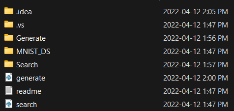
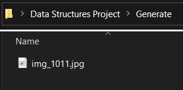
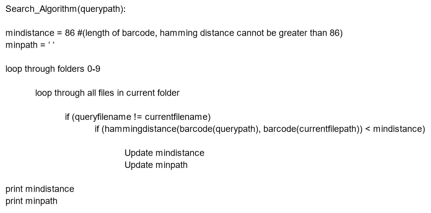
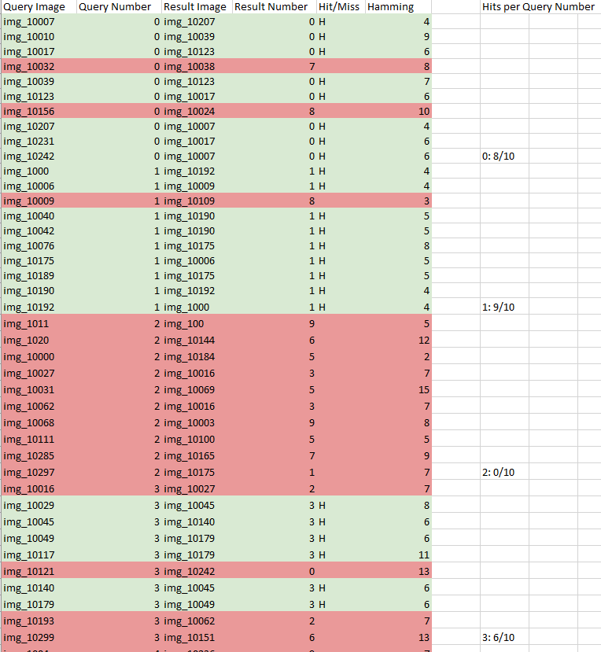
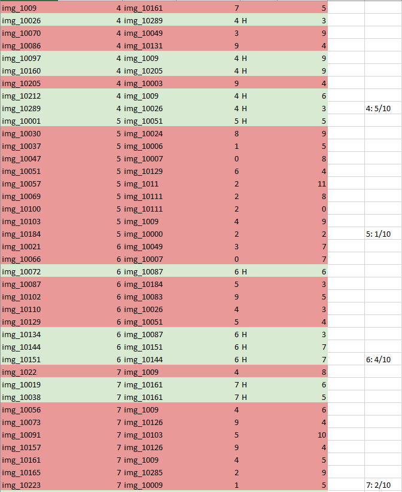
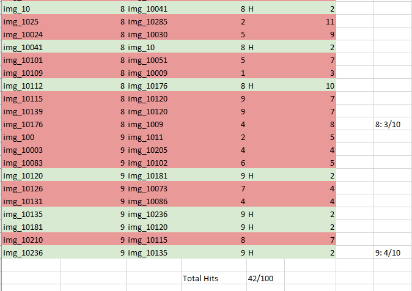

**Content Based Image Retrieval (CBIR) Using Barcodes**

Data Structures

SOFE 2715U

Dr. Shahryar Rahnamayan

*Nagahiro Aoyama - 100777345*

*Brandon Ho - 100754357*

*Parasjeet Marwah - 100787512*

*Zainab Nomani - 100784761*

*April 14, 2022*

# **Abstract**

In this project we are given a pool of 100 images in order to create a search algorithm. This algorithm will ask us to provide a picture from the pool and it will then run through the other 99 images and find the images that are the most similar to the input image Our problem was to find a solution to effectively create barcodes for each image and find the Hamming distance. The individual Hamming distance will then be compared to those in the pool, and the most similar image will be retrieved. The retrieval accuracy for this algorithm was 42%; algorithms with such complexities will never reach a 100% level of accuracy. The improvements we can make in this study would be relieving a higher hit ratio (%) and a smaller Big-O.

**Explanation of Algorithms**

### **Barcode Generator Algorithm**

In this algorithm, the expected result is to have a generated barcode with its projections produced with a desired image, chosen by the user.

Inside the project folder, as shown above it contains some key files and folders. In order to receive a generated barcode for a desired image, first you must place that image in the Generate folder as shown below.

This will allow the code to identify the image that a barcode would like to be generated for. Next, the MNIST_DS folder contains 100 images which will be used as our search pool. Once the desired image is placed in the Generate folder we can now run generate.py. Inside the code there is a database which contains all 100 barcodes for each image in MNIST_DS. The Barcode_Generator function works by taking our desired image and initializing an empty array for all 4 projections labeled projection 1-4. Through the use of external libraries such as os, numpy and PIL we can then open the image to view it as an array of numbers in order to calculate the projections. Next, we calculate the projections of the 28x28 image in angles of 0, 45, 90 and 135. Once the projections have been calculated, we can then pass it to another function called generate_c to convert our projections into binary (1 or 0). The program determines whether it will be a 1 or 0 through the use of an if statement, if the projection is greater than the average of the threshold it is a 1, otherwise it is 0. Finally, we now have c1-4 and this is combined to make the full RBC barcode.

### **Search Algorithm**

The search algorithm builds off the barcode generator algorithm to take a query image and find the most similar image to it inside the database. Similarity is measured through calculating the hamming distance between the query image barcode and the barcode of images in the database, with a lower hamming distance indicating a greater similarity. The algorithm follows the pseudocode below:

The overall flow is simple, and closely resembles an algorithm one might use to find, say, the lowest integer in an int array. The two loops exist because of the folder structure in the database, and combined allow for the code to check all files contained in the MNIST_DS folder. The code checks for the filename to prevent returning the query image as the result, then compares the hamming distance to the minimum hamming distance found so far. After going through all files the algorithm returns the file path of the most similar image to the query image, as well as the measured hamming distance. It is worth noting that if two images are found to have the same minimum hamming distance with the query image, only the first image is considered and the latter ones are discarded.

### **Measurements and Analysis**

**Retrieval Accuracy**

The algorithm provided is designed to two of the following steps; 1) generate a barcode for a provided picture, 2) Using that barcode to create a search algorithm to find an image most similar within the pool of 100 images given. Like any solution, the retrieval accuracy will not be perfect and the expected rhetorical accuracy was 65%. Our algorithm received a 42% retrial accuracy, a large portion of the inaccuracy being due to the numbers 2 and 5. The numbers are very similar and it can be said that they are inverses of each other's image.

**Big-O Complexity**

Big-O notation describes the complexity of an algorithm and it can change depending on the size of the input. Since we are looking at two algorithms, the barcode generator and the search algorithm, we will have two complexities. The Big-O of the barcode generator is constant as you are always inputting 28 pixels by 28 pixels, therefore the complexity will be O(1). However the complexity can change depending on the size of the images you are inputting. If your algorithm can handle taking in various sizes of images then the Big-O would not be constant.

The Big-O of the search algorithm is dependent on the size of the barcode, n, which was generated in the previous algorithm. Since we need to compare two barcodes of the size n the Big-O would be O(n) for the first barcode and O(n) for the second barcode. When multiplied it will give us with the complexity of O().

# 

# 

# 

# 

# 

# **Search Results**

The following is a table of all searches, including query image/number, result image/number, hit/miss, hamming distance and hits per query number. 0, 1, 3 and 4 contained the most hits. The overall hit ratio is 42%.

# **Improvements**

The barcode generation code uses the pillow library to pull data from image files. The numpy library is then used to assign values based on individual pixels from the image into a multidimensional array. Based on our search results, we yielded a hit ratio of 42% from a sample of 100 image searches. One way we can improve the retrieval accuracy is by improving the barcode generation code. Our barcode generation code takes only 4 projections; if more projections are taken on each image, barcodes of different digits will be more distinct. The more distinct the barcodes of different numbers are, the higher their hamming distance will be. In this way the search algorithm will be able to avoid matching digits that are different and improve upon the retrieval accuracy.

# **Conclusion**

Content Based Image Retrieval is a vital yet challenging task to acquire. We see its use in our day to day technology and even in medical situations. The work that was done within this report has shown us the next steps we can take to improve our algorithms. We can achieve this by increasing the amount of projections that the algorithm can take. Although this report was an introduction to the idea of CBIR, we can conclude that we have only hit a small component of what it can do.
